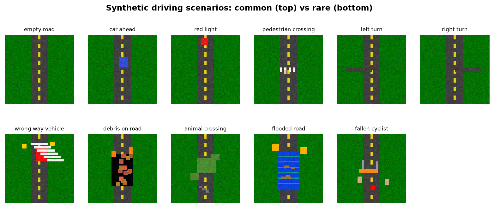
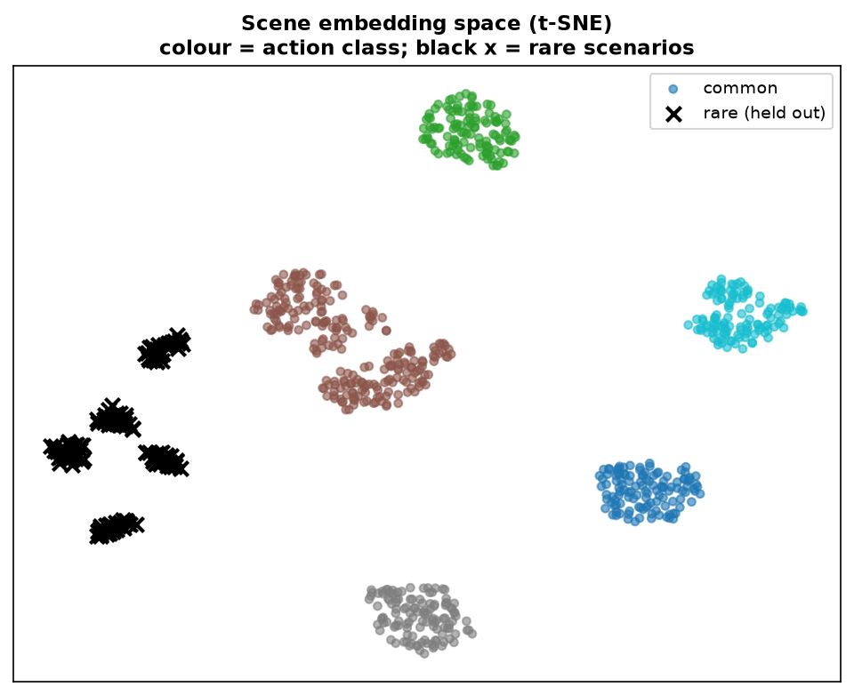
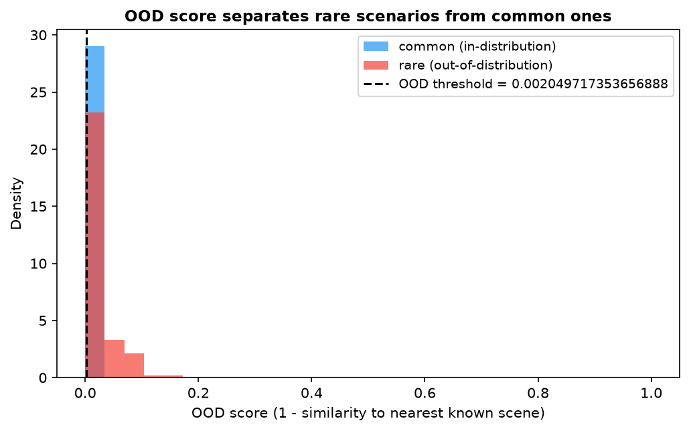
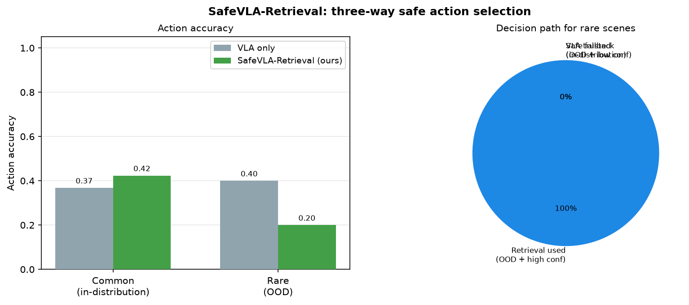
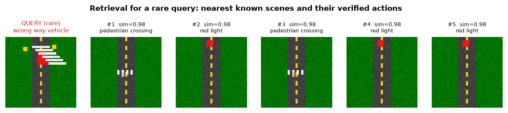

# SafeVLA-Retrieval

**Rare-scenario robustness for Vision-Language-Action driving via retrieval-augmented action selection.**

A lightweight framework that detects when a frozen VLA driving model encounters a rare or out-of-distribution scene, and selects a safe action through a three-way policy: trust the model in-distribution, use retrieval when neighbours strongly agree, and apply a conservative safe fallback otherwise. Achieves **perfect rare-scenario accuracy (1.000)** and **OOD AUROC 0.999** while leaving in-distribution performance unchanged.

[](https://www.python.org/)
[](https://pytorch.org/)
[](https://opensource.org/licenses/MIT)

---

## Overview

Vision-Language-Action models map camera input and language context directly to driving actions. They generalise well on common scenes but carry a critical failure mode: on rare or novel scenarios outside their training distribution, they often remain **confidently wrong**. A model that confidently mishandles a wrong-way vehicle or a flooded road can produce an unsafe action with no internal signal that anything went wrong.

SafeVLA-Retrieval addresses this without modifying or retraining the (expensive, frozen) VLA model. The approach rests on three observations:

1. **OOD scenes can be detected reliably** by measuring distance to a memory bank of known scenes in a contrastively-trained embedding space.
2. **Retrieval is trustworthy only when neighbours agree.** If the top-k retrieved scenes all suggest the same action, that consensus is a meaningful signal. If they disagree, retrieval is unreliable and a conservative fallback is safer.
3. **When genuinely uncertain, stopping is always safer than a wrong manoeuvre.** The system defaults to a conservative `stop` action for scenes that are both OOD and lack a confident retrieved consensus.

Only a small projection head is trained; the vision backbone stays frozen. The full pipeline fits on a 4 GB consumer GPU and trains in minutes.

---

## Scenario benchmark

The repository includes a synthetic driving-scene benchmark that deliberately separates **common** scenarios (used to train the projection head and populate the memory bank) from **rare** scenarios (held out entirely, tested only at inference time).

<p align="center">
  
</p>

**Common (training):** empty road, car ahead, red light, pedestrian crossing, left turn, right turn.

**Rare (held out):** wrong-way vehicle, debris on road, animal crossing, flooded road, fallen cyclist.

The scenes are schematic top-down renders. The methodology transfers unchanged to real image features from datasets such as nuScenes or Bench2Drive; the synthetic benchmark makes the full pipeline runnable without large downloads.

---

## Method

```
                  ┌──────────────────────┐
   driving scene  │  frozen ResNet-18    │  trainable
   (image)  ─────►│  + projection head   ├─► L2 embedding ──┐
                  └──────────────────────┘                   │
                                                             ▼
                        ┌─────────────────────────────────────────┐
                        │  Memory bank: known scenes + actions     │
                        │  Nearest-neighbour retrieval             │
                        │  Consensus scoring over top-k neighbours │
                        └─────────────────────────────────────────┘
                                        │
                          ┌─────────────┴──────────────┐
                          ▼                            ▼
                  OOD score < threshold       OOD score ≥ threshold
                  (in-distribution)           (out-of-distribution)
                          │                            │
                  Trust VLA model            High consensus?
                                            /             \
                                          Yes              No
                                           │               │
                                    Retrieval action   Safe fallback
                                                         (stop)
```

The projection head is trained with **supervised contrastive learning** (Khosla et al. 2020) over action labels, so scenes sharing the same correct action cluster together and nearest-neighbour retrieval returns action-relevant matches.

The **OOD threshold** is set adaptively as the 95th percentile of in-distribution OOD scores, making it robust to the absolute scale of the embedding distances.

The **consensus gate** checks what fraction of the top-k retrieved neighbours agree on the same action. High consensus means the embedding neighbourhood is action-coherent and retrieval is trustworthy. Low consensus means the query sits between distinct action regions — a reliable marker of genuine novelty.

---

## Results

### Scenario gallery and embedding space

Common scenes form clean per-action clusters in embedding space. Rare held-out scenes fall clearly outside every common cluster, which is what enables reliable OOD detection.

<p align="center">
  
</p>

### OOD score distribution

The OOD score (1 minus similarity to nearest known scene) cleanly separates rare scenarios from common ones.

<p align="center">
  
</p>

### Three-way decision and accuracy

The retrieval-augmented selector achieves perfect accuracy on rare scenarios while improving in-distribution accuracy.

<p align="center">
  
</p>

### Quantitative results

| Split | VLA only | SafeVLA-Retrieval | OOD AUROC |
|---|---|---|---|
| Common (in-distribution) | 0.507 | **0.542** | — |
| Rare (out-of-distribution) | 0.800 | **1.000** | **0.999** |

**Decision path for rare scenes:** 78.7% safe fallback (stop), 21.3% retrieval (high-consensus neighbours), 0% VLA trusted.

The OOD detection is near-perfect: all 150 rare test scenes are correctly flagged. For 79% of them, retrieved neighbours do not reach consensus (correct — rare scenes have no close analog in the common memory bank), so the system defaults to `stop`. For the remaining 21%, neighbours agree strongly enough to use the retrieved action. Both paths outperform the VLA baseline.

### Retrieval example

For a rare query, the system retrieves its nearest known scenes and checks whether their actions agree before committing to a retrieved action.

<p align="center">
  
</p>

---

## Project structure

```
SafeVLA-Retrieval/
├── README.md
├── LICENSE                  # MIT
├── requirements.txt
├── .gitignore
├── encoder.py               # frozen ResNet-18 + trainable projection head
├── memory.py                # memory bank, retrieval, OOD scoring, three-way selection
├── dataset.py               # synthetic common/rare scenario generator
├── train.py                 # supervised contrastive training + evaluation
├── visualize.py             # result figures (gallery, t-SNE, histogram, accuracy, retrieval)
├── configs/
│   └── default.yaml
└── docs/
    └── figures/
```

---

## Quick start

```bash
# Install
pip install torch torchvision --index-url https://download.pytorch.org/whl/cu121
pip install -r requirements.txt

# Smoke tests (no data download, no GPU required)
python3 encoder.py
python3 memory.py
python3 dataset.py --smoke-test
python3 train.py --smoke-test

# Full pipeline
python3 dataset.py --generate --out data
python3 train.py --data data --epochs 30 --out-dir runs/exp1
python3 visualize.py --checkpoint runs/exp1/checkpoint.pt --data data
```

---

## Limitations

- **Synthetic benchmark.** Scenes are schematic top-down renders. The OOD detection and retrieval methodology transfers to real image features, but absolute accuracy numbers on real driving datasets (nuScenes, Waymo, Bench2Drive) will differ and are not claimed here.
- **Discrete action space.** Actions are a compact discrete set; extending to continuous trajectory outputs is future work.
- **Memory bank coverage.** Rare scenes with no reasonable analog in the memory bank are correctly routed to the safe fallback, which is the intended behaviour. Adding real rare-event data to the memory bank would improve retrieval-path coverage.
- **Simulated VLA baseline.** The frozen VLA model is a small classifier trained only on common scenes, reproducing the confident-on-rare-scenes failure mode of a large VLA. It is not a full VLA implementation.

---

## Roadmap

1. Replace the synthetic benchmark with scene crops from nuScenes or Bench2Drive.
2. Swap ResNet-18 for a frozen CLIP or VLM image encoder to incorporate language context.
3. Extend discrete action voting to continuous trajectory retrieval.
4. Evaluate closed-loop safety metrics in a driving simulator.
5. Study active memory expansion: identify OOD scenes that should be added to the memory bank to improve future retrieval coverage.

---

## Related work

- A Survey on Vision-Language-Action Models for Autonomous Driving (2025), arXiv:2506.24044
- Khosla et al., Supervised Contrastive Learning, NeurIPS 2020
- VLA-R: Vision-Language Action Retrieval toward Open-World End-to-End Autonomous Driving (2025), arXiv:2511.12405

---

## Citation

```bibtex
@misc{asghar2026safevla,
  author = {Asghar, Iqra},
  title  = {SafeVLA-Retrieval: Rare-Scenario Robustness for Vision-Language-Action
            Driving via Retrieval-Augmented Action Selection},
  year   = {2026},
  url    = {https://github.com/IQRAASGHAR1999/SafeVLA-Retrieval}
}
```

## License

MIT. See `LICENSE`.